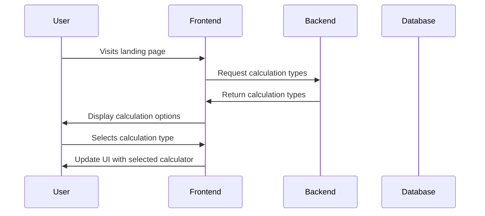
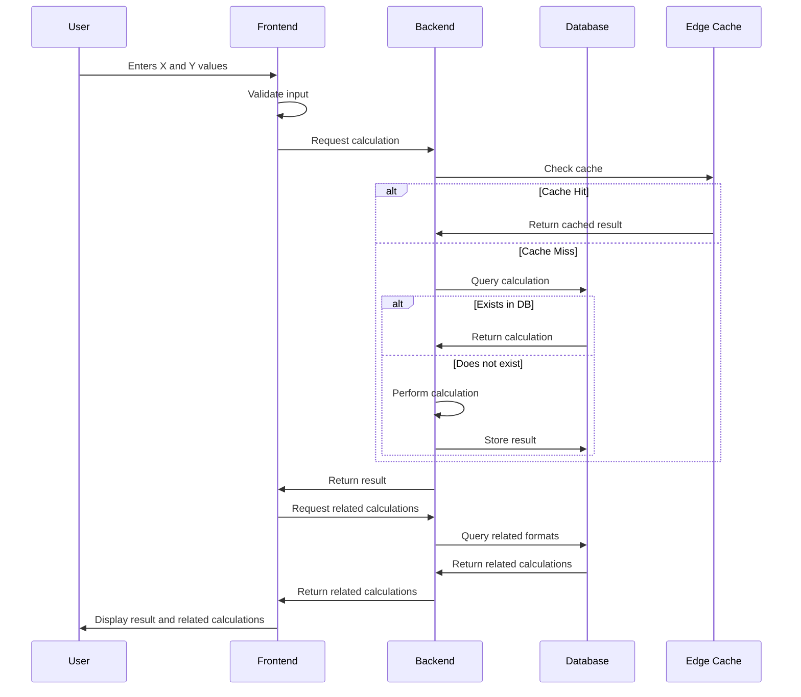
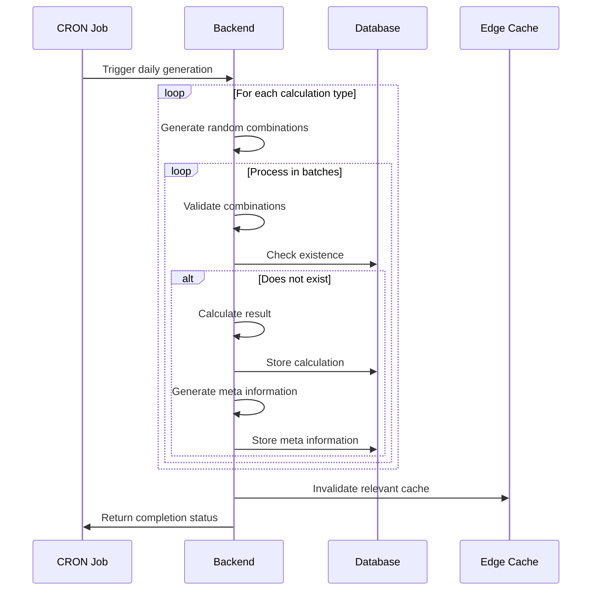
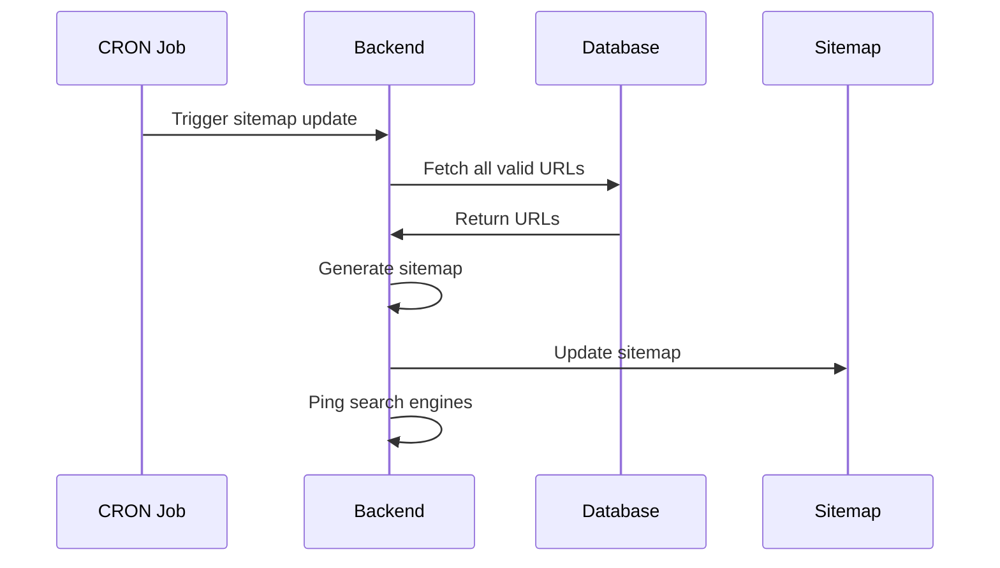
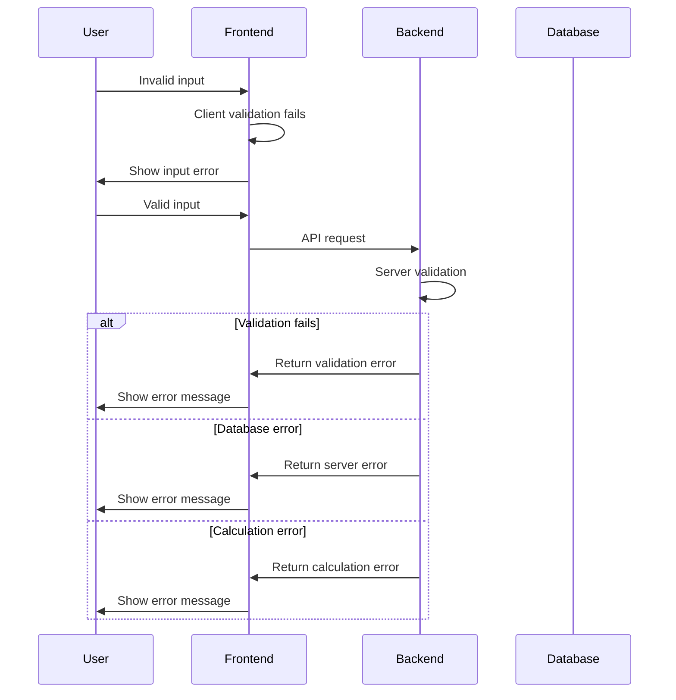
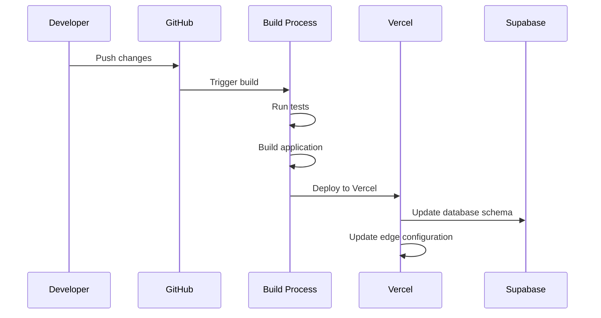

# Detailed Application Flow Documentation

## 1. User Flows

### 1.1 Landing Page Flow


### 1.2 Calculation Flow


## 2. System Processes

### 2.1 CRON Job Flow


### 2.2 SEO Update Flow


## 3. Component Interactions

### 3.1 Frontend Components
```typescript
interface ComponentFlow {
    Calculator: {
        handles: [
            'Input validation',
            'Format selection',
            'Result display',
            'Error messaging'
        ],
        interactsWith: [
            'API service',
            'URL service',
            'State management'
        ]
    },
    ResultDisplay: {
        handles: [
            'Primary result rendering',
            'Step-by-step explanation',
            'Related calculations',
            'Error states'
        ],
        interactsWith: [
            'Calculator',
            'State management'
        ]
    }
}
```

### 3.2 Backend Services
```typescript
interface ServiceFlow {
    CalculationService: {
        handles: [
            'Calculation logic',
            'Caching',
            'Database interactions'
        ],
        interactsWith: [
            'Database',
            'Cache layer',
            'URL service'
        ]
    },
    URLService: {
        handles: [
            'Slug generation',
            'Redirects',
            'Canonical URLs'
        ],
        interactsWith: [
            'Database',
            'Meta service'
        ]
    }
}
```

## 4. State Management

### 4.1 Frontend State
```typescript
interface AppState {
    calculator: {
        selectedFormat: CalculationFormat;
        valueX: number | null;
        valueY: number | null;
        result: CalculationResult | null;
        isLoading: boolean;
        error: Error | null;
    };
    display: {
        showSteps: boolean;
        showRelated: boolean;
    };
    ui: {
        isMobile: boolean;
        theme: 'light' | 'dark';
    };
}
```

### 4.2 Cache Strategy
```typescript
interface CacheStrategy {
    edgeCache: {
        duration: '24h';
        patterns: [
            '/api/calculations/*',
            '/api/meta/*'
        ];
        invalidation: {
            patterns: string[];
            triggers: string[];
        };
    };
    browserCache: {
        duration: '1h';
        types: string[];
    };
}
```

## 5. Error Handling

### 5.1 Error Flow


## 6. Performance Optimization

### 6.1 Caching Strategy
1. Edge Caching
   - Cache calculation results
   - Cache meta information
   - Cache related calculations

2. Browser Caching
   - Cache static assets
   - Cache calculation types
   - Cache UI components

### 6.2 Database Optimization
1. Indexing Strategy
   - Compound indexes for common queries
   - Partial indexes for specific conditions

2. Query Optimization
   - Use prepared statements
   - Implement connection pooling
   - Optimize JOIN operations

## 7. Deployment Flow

### 7.1 CI/CD Pipeline


This detailed flow documentation provides a comprehensive understanding of:
1. User interactions and system processes
2. Component relationships and dependencies
3. State management and data flow
4. Error handling and recovery
5. Performance optimization strategies
6. Deployment and maintenance procedures